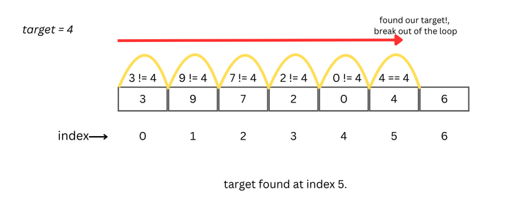

# **Introduction To The Linear Search Algorithm**

Linear search, also known as sequential search, is a method for finding an element in a linear data structure by checking each element one by one until a match is found or the entire structure has been traversed.

For example, when searching for a specific book on a bookshelf, you would examine each book sequentially until you find the one you're looking for, or reach the end of the row without success.

Linear search can also be adapted to meet specific needs. For instance, instead of checking for an exact match, you might search for any number greater than a given target in an array of integers.



## **Algorithm**

1. Iterate through the list from the first item to the last.
2. For each iteration, check if the data at the current index matches the target:
   - If a match is found, break out of the loop.

## **Implementation**

```python
def linear_search(arr, target):
    for number in arr:
        if number == target:
            return True

    return False
```

This function accepts two parameters: an array `arr` and the value to search for, `target`. It iterates through `arr` and checks if the current element is equal to `target`. If a match is found, the function immediately returns `True`. If no match is found after iterating through the entire array, it returns `False`, indicating that the `target` is not present in the array.

## **Complexity Analysis**

- **Time Complexity**: The time complexity of the linear search algorithm is `O(n)`, where `n` is the number of items in the data structure. In the worst case, if the target element is either not present or at the very end of the list, the algorithm will need to iterate through all `n` elements.
- **Space Complexity**: The space complexity is `O(1)` because the algorithm only uses a constant amount of extra memory regardless of the input size, as it doesn't require any additional data structures to hold elements.

## **Advantages Of Linear Search**

1. Simple to understand and implement.
2. No need for sorted data, it works on unsorted structures.
3. Can be used on any linear data structure like arrays or linked lists.
4. Does not require extra memory aside from the input data.
5. Efficient for small datasets.

## **Disadvantages Of Linear Search**

1. Inefficient for large datasets due to `O(n)` time complexity.
2. Requires checking each element, which can be slow for long lists.
3. Not suitable for use when speed is a priority in searching operations.
4. No ability to skip elements or reduce the search space.
5. Cannot take advantage of sorted data, unlike more advanced algorithms (e.g., binary search).

## **Linear Search use Cases**

1. Searching in small or unsorted datasets.
2. Finding a particular item in a list where the structure is linear.
3. When simplicity and ease of implementation are prioritized over performance.
4. When data is constantly being updated or inserted, making sorting impractical.
5. Checking for a condition in every element of a list (e.g., finding a threshold value).