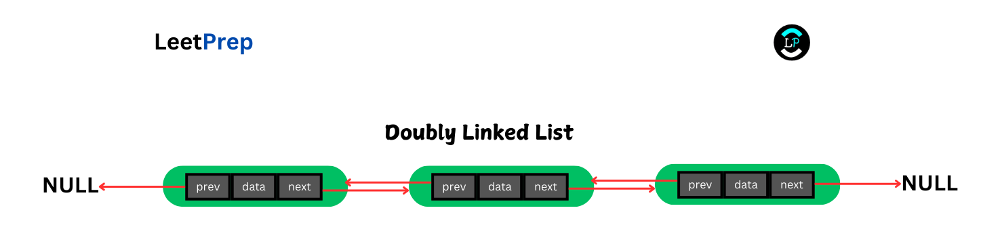
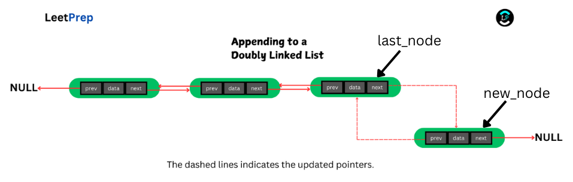

# **INTRODUCTION TO LINKED LISTS**

In this course, we will explore the array data structure, a fundamental building block for some other data structures. This course is divided into the following sections:

1. **Definition of Linked Lists**
2. **Types of Linked Lists**
3. **Linked Lists Operations**
4. **Advantages of Linked Lists**
5. **Disadvantages of Linked Lists**
6. **Applications of Linked Lists**
7. **Visualization of Real-World Example to Understand Linked Lists**
8. **Practice Problems on Linked Lists**

## **Definition of Linked Lists**

A **linked list** is a linear data structure consisting of individual connected elements called nodes. A node contains two parts:

1. Data: The actual value stored in the node.
2. Pointer/Reference: A link to the next node in the sequence (and an additional pointer to the previous node in the case of a doubly linked list).

Unlike arrays, which are stored in contiguous memory locations, linked lists do not require contiguous memory. Instead, each node holds a reference to the next node (and the previous node in doubly linked lists), allowing for more flexible memory allocation.

Additionally, linked lists offer efficient insertion and removal of elements from any position, as the nodes do not need to be shifted like in arrays.

Understanding linked lists will give you a good background to understand other data structures like trees later on.

## **Types of Linked Lists**

There are 2 main types of linked lists, namely:

1. Singly Linked Lists
2. Double Linked Lists

**Singly Linked Lists**: In a singly linked list, each node contains two parts: the data it stores and a pointer to the next node in the sequence. This allows traversal in one direction—from the first node to the last—by following the next pointer of each node. The nodes are not stored contiguously in memory, but the structure ensures a linear traversal from start to end.

![[Diagram Here]](/home/macdonald/Desktop/LinkedLists/singly-ll.png)

**Doubly Linked Lists**: Doubly linked lists function similarly to singly linked lists, but with an added feature: each node contains an additional pointer to the previous node. This allows traversal in both directions, meaning you can start at the end of the list and move backward to the beginning by following the previous pointers, or move forward by following the next pointers.

## **Linked Lists Operations**

There are several operations you can perform on a Linked List, depending on the task at hand. Here are some of the basic ones:

1. **Traversing a Linked List**
2. **Searching a Linked List**
3. **Appending to a Linked List**
4. **Inserting into a Linked List**
5. **Deleting from a Linked List**
6. **Detecting Cycles in a Linked List**

`head` in a linked list typically refers to the first node in the list.

### **Traversing a Linked List**

This is the most fundamental operation on a Linked List, which involves starting at the head node and following the next pointers until the end.

- Time Complexity: `O(n)`, where `n` is the number of nodes in the list.
- Space Complexity: `O(1)`, since no additional memory is required.

------

### **Searching a Linked List**

Searching involves finding a specific item within the linked list. This is done by traversing the list and checking each node’s value.

- Time Complexity: `O(n)` (worst case), if the element is at the end or doesn't exist.
- Space Complexity: `O(1)`, since no extra memory is needed.

------

### **Appending to a Linked List**

Appending involves adding a new node at the end of the linked list. The process differs slightly for singly and doubly linked lists.

**Singly Linked List**:

If the current head node is `None`, create a new node `new_node` with the data you want to insert and set the head node to `new_node`. Otherwise, follow the steps below.

1. Traverse to the last node in the list and store it in a variable `last_node`.
2. Create a new node `new_node` with the data.
3. Set the `next` pointer of `last_node` to `new_node`.

**Doubly Linked List**:

If the head node is `None`, create a new node `new_node` with the data you want to insert and set the head node to `new_node`. Otherwise, follow the steps below.

1. Traverse to the last node in the list and store it in a variable `last_node`.
2. Create a new node `new_node` with the data and set its `prev` pointer to `last_node`.
3. Set the `next` pointer of `last_node` to `new_node`.

**Time Complexity**: In the worst case, the time complexity is `O(n)` if we have to traverse the entire list to find the last node. However, if we maintain a reference to the last node, the time complexity improves to `O(1)` since we can directly update the last node's `next` pointer and set the new node as the last node without traversal.

**Space Complexity**: `O(1)`, since no extra memory is needed.

------

### **Inserting into a Linked List**:

Insertion involves adding a new node to the list at a specific position. The process differs slightly for singly and doubly linked lists.

**Singly Linked List**:

If the target index is `0`, create a new node `new_node` with the data you want to insert, and set its next pointer to the current head node. Then, update the head node to point to `new_node`. Otherwise, follow the steps below.

1. Traverse to the node just before the target position and store in a variable `current_node`.
2. Store the node after `current_node` in `next_node`.
3. Create the new node `new_node`.
4. Set `new_node.next` to `next_node`.
5. Set `current_node.next` to `new_node`.

**Doubly Linked List**:

If the target index is `0`, create a new node `new_node` containing the data you want to insert. Set its `prev` pointer to `None` since it will be the new head, and its `next` pointer to the current head node; Update the `prev` pointer of the current head node to point back to the `new_node`, since the new node will now be the first node in the list. Otherwise, follow the steps below.

1. Traverse to the node before the target position and store it in a variable `current_node`.
2. Store the node after `current_node` in `next_node`.
3. Create the new node `new_node`.
4. Set `current_node.next` to `new_node`.
5. Set `new_node.prev` to `current_node`.
6. Set `new_node.next` to `next_node`.
7. Update `next_node.prev` to `new_node`.

![[Diagram Here]](doubly-ll-insert.png)

**Time Complexity**: `O(n)` (worst case, when inserting at the end).

**Space Complexity**: `O(1)`.

------

### **Deleting from a Linked List**

Deletion involves removing a node from a specific position. The process also differ slightly for singly and doubly linked lists.

**Singly Linked List**:

If the target index is `0`, update the head node to point to the next node of the current head. Otherwise, follow the steps below.

1. Traverse to the node just before the target and store it in a variable `current_node`.
2. Store the node to be deleted which is the `current_node` next node (`node_to_delete`) and its next node (`new_next_node`).
3. Set `current_node.next` to `new_next_node`.

![[Diagram Here]](/home/macdonald/Desktop/LinkedLists/singly-ll-delete.png)

**Doubly Linked List**:

If the target index is `0`, update the head node to point to the next node of the current head. Otherwise, follow the steps below.

1. Traverse to the node before the target  and store it in a variable `current_node`.
2. Store the node to be deleted which is the `current_node` next node (`node_to_delete`) and its next node (`new_next_node`).
3. Update `current_node.next` to `new_next_node`.
4. Update `new_next_node.prev` to `current_node`.

![[Diagram Here]](next.png)

**Time Complexity**: `O(n)` (worst case).

**Space Complexity**: `O(1)`.

------

### **Detecting Cycles in a Linked List**

A cycle in a linked list occurs when a node’s next pointer points back to a previous node, creating an infinite loop. This can be detected using the **Fast and Slow Pointer Technique** (Floyd’s Cycle-Finding Algorithm) or by storing visited nodes in an additional data structure.

We will implement cycle detection when building our linked list.[Diagram Here]

When we go over to building the linked list, we will implement a cycle detection functionality for our linked list.

**Algorithm using an extra data structure (Set) for cycle detection:**

1. Initialize an empty set called `visited` to store the nodes we have already seen.
2. Start from the head node and iterate through the linked list.
3. For each node, check if the next node has already been added to the visited set:
   - If it has, a cycle exists, and the algorithm returns `True`.
   - If it hasn't, add the current node to the `visited` set.
4. Move to the next node and continue until you reach the end of the list.
5. If the end of the list is reached without finding a cycle, return `False`.

## **Advantages of Linked Lists**

1. Dynamic sizing allows linked lists to grow or shrink as needed without predefined limits.
2. Efficient insertions and deletions, especially at the beginning or middle of the list, without the need for shifting elements.
3. Memory is used only when required, as nodes are created dynamically.
4. No memory wastage compared to arrays, which may allocate unused space.
5. Flexibility in structuring data, with different types like singly, doubly, and circular linked lists offering various functionalities.

## **Disadvantages of Linked Lists**

1. No direct access to elements, requiring traversal from the head to access a specific node, making retrieval slower.
2. Extra memory is needed to store pointers for each node, leading to higher memory overhead.
3. Poor cache locality, as nodes are scattered across memory rather than stored contiguously.
4. Implementation is more complex, with the need for careful management of pointers, especially in doubly linked lists.
5. Operations like finding the middle or reversing the list are more complex compared to arrays.

## **Applications of Linked Lists**

1. Used to implement dynamic data structures such as stacks, queues, and hash table chains.
2. Useful in handling dynamic memory allocation in operating systems or real-time applications.
3. Ideal for scenarios requiring frequent insertions and deletions, such as undo functionality in software applications.
4. Applied in graph algorithms for storing adjacency lists, allowing flexible management of connections.
5. Suited for memory-efficient representation of sparse data, where fixed-size arrays would be wasteful.

## **Practical Problems on Linked Lists**

- [Remove Linked List Elements](https://leetprep.io/problems/203)
- [Reverse Linked List](https://leetprep.io/problems/206)
- [Linked List Cycle](https://leetprep.io/problems/141)

Explore more from the recommendations of any of those problems on **LeetPrep**.