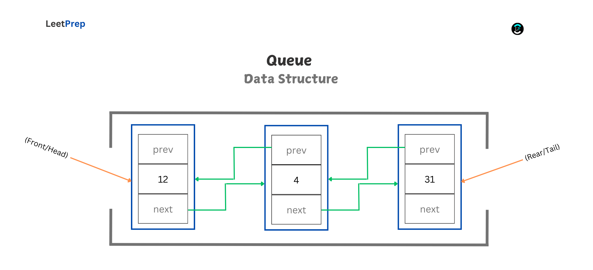
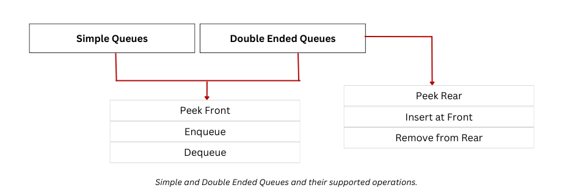
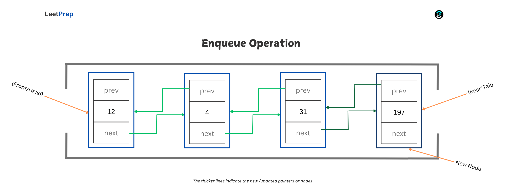
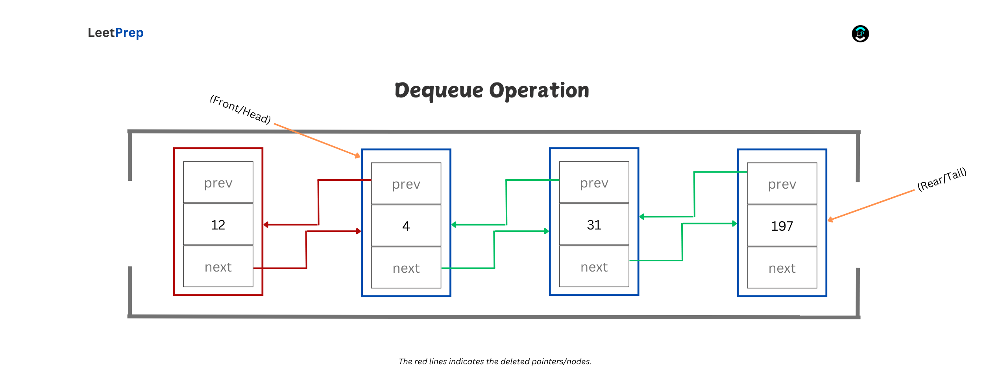
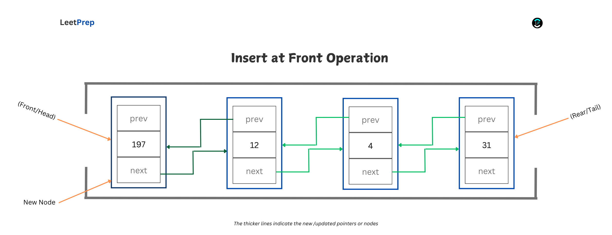
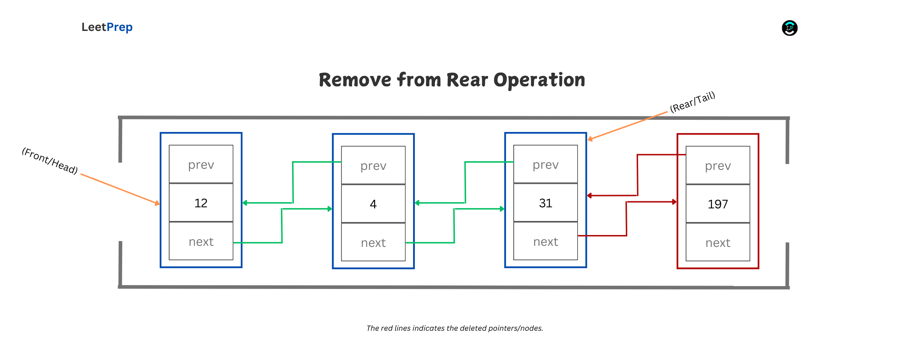

# **INTRODUCTION TO Queues**

In this course, we will explore the queue data structure. This course is divided into the following sections:

1. **Definition of Queues**
2. **Types of Queues**
3. **Queue Operations**
4. **Advantages of Queues**
5. **Disadvantages of Queues**
6. **Applications of Queues**
7. **Practice Problems on Queues**

## **Definition of Queues**

A queue is a linear data structure that operates on the principle of FIFO (First In, First Out). This means that the first item added to the queue is the first to be removed.

Imagine a line of people waiting at a ticket counter. The first person to join the line is the first to be served, and new people join at the end of the line.

A queue can be implemented using two main data structures:

1. **Array-Based Implementation**:
   - Fixed Size: Uses an array with a fixed size to store elements.
   - Operations: `enqueue` (inserting an element) is done at the end, while `dequeue` (removing an element) is done from the front.
   - Considerations: This approach may lead to issues like wasted space when elements are dequeued, requiring techniques such as circular arrays to optimize space.

2. **Linked List-Based Implementation**:
   - Dynamic Size: A linked list-based queue can grow or shrink dynamically as needed.
   - Operations: `enqueue` involves adding a new node at the end (tail) while, `dequeue` involves removing a node from the front (head).
   - Efficiency: This approach provides more flexibility, as it avoids the fixed-size limitation of arrays.

In the following explanations, we'll focus on implementing a queue using a doubly linked list. We'll also maintain pointers to both the `front` (head) and `rear` (tail) of the list to efficiently handle all operations. Ensure you've gone through our linked lists course before this.

## **Types of Queues**

1. **Simple Queue**: A simple queue follows the FIFO (First In, First Out) structure. Elements can only be inserted at the rear and removed from the front of the queue.
2. **Double-Ended Queue (Deque)**: A deque allows insertion and deletion at both the front and rear ends. It has two main variations:
   1. Input-Restricted Queue: In this type, insertion is allowed only at one end, but deletion can be performed from either end.
   2. Output-Restricted Queue: In this type, insertion is allowed at both ends, but deletion can only be performed from one end.
3. **Circular Queue**: A circular queue connects the last position back to the first, forming a circle. It follows the FIFO principle, making efficient use of space by reusing positions freed by dequeued elements.
4. **Priority Queue**: In a priority queue, elements are accessed based on their assigned priority. There are two main types:
   1. Ascending Priority Queue: Elements are arranged in increasing order of priority values, with the smallest priority value being dequeued first.
   2. Descending Priority Queue: Elements are arranged in decreasing order of priority values, with the largest priority value being dequeued first.

We'll focus primarily on simple queues and double-ended queues in this course, while other types will be covered in future courses.

## **Queue Operations**

There are several operations you can perform on queues. Here are some of the basic ones:

### **Peek** Front

This operation involves retrieving the value of the first element (the front of the queue/head of the linked list) without removing it or modifying any pointers.

The **Time Complexity** is O(1), because it directly accesses the front/head node, while the **Space Complexity** is also O(1), because no additional space is used beyond the current queue structure.

------

### **Enqueue**

This operation involves adding a new element to the end of the queue (the rear/tail of the linked list). A new node is created, and the current `rear` node's `next` pointer is set to point to this new node. The `rear` pointer is then updated to the new node.

The **Time Complexity** is O(1), because inserting at the end of the linked list is a constant-time operation, while the **Space Complexity** is also O(1), because adding a single node only requires the space of the new node itself.

------

### **Dequeue**

This operation involves removing and returning the first element (the front/head of the queue). The `front` pointer is updated to the `next` node, effectively detaching and removing the original front node.

The **Time Complexity** is O(1), because removing the front node and updating the pointer is done in constant time, while the **Space Complexity** is also O(1) as no additional space is used; the existing node is simply removed from the queue.

------

### **Peek Rear**

This operation involves retrieving the value of the last element (the rear/tail of the queue) without removing it or modifying any pointers.

The **Time Complexity** is O(1), because it directly accesses the `rear`/tail node, while the **Space Complexity** is also O(1), because no additional space is used beyond the current queue structure.

------

### **Insert at Front**

This operation involves adding a new element to the front of the queue. A new node is created, and its `next` pointer is set to point to the current `front` node. The `front` pointer is then updated to this new node.

The **Time Complexity** is O(1), because inserting at the front of the linked list is a constant-time operation, while the **Space Complexity** is O(1), because only the space for the new node is required.

------

### **Remove from Rear**

This operation involves removing and returning the last element (the rear/tail of the queue). The linked list is traversed to find the second-to-last node, which is then updated to become the new `rear`. The original last node is detached and removed.

The **Time Complexity** is O(n), because finding the second-to-last node requires traversing the linked list, while the **Space Complexity** is O(1), as no additional space is used beyond the node being removed.

------

## **Advantages of Queues**

1. Queues ensure that elements are processed in the order they arrive, making them ideal for applications that require orderly task management, such as scheduling.
2. They provide efficient enqueue and dequeue operations that run in constant time when implemented with a linked list.
3. Queues are flexible, allowing for implementation using arrays or linked lists, which can be tailored to different resource requirements.
4. They are commonly used in systems for buffering data streams, managing tasks in multi-threaded programs, and handling print jobs.
5. Queues support concurrent processing, making them suitable for producer-consumer scenarios and synchronization between threads or processes.

## **Disadvantages of Queues**

1. Queues offer limited access as only the front and rear elements can be accessed, restricting their use in operations that need more flexible data manipulation.
2. Fixed-size implementations, such as array-based queues, can lead to overflow if the maximum capacity is exceeded.
3. Circular array implementations can leave unused space if not managed properly when wrapping around.
4. Traversing to access elements other than the front or rear is inefficient, making searching an O(n) operation.
5. Linked-list-based queues require careful memory management to prevent issues like memory leaks, adding complexity to their implementation.

## **Applications of Queues**

1. Queues are used in operating systems for job scheduling, ensuring tasks and processes are handled in the order they are received.
2. They manage data streams effectively, such as buffering input from IoT devices or handling user interactions in real-time applications.
3. Print spooling uses queues to organize print jobs in the order they are sent, allowing fair processing.
4. Customer service systems rely on queues to serve requests as they come in, maintaining order and fairness.
5. In network packet management, queues maintain the sequence of packets for routers and switches, ensuring proper data transmission.

## **Practical Problems on Queues**

- [Dota2 Senate](https://leetprep.io/problems/649)
- [Kth Largest Element in an Array](https://leetprep.io/problems/215)
- [Process Tasks Using Servers](https://leetprep.io/problems/1882)
- [Design Twitter](https://leetprep.io/problems/355)

Explore more from the recommendations of any of those problems on **LeetPrep**.
