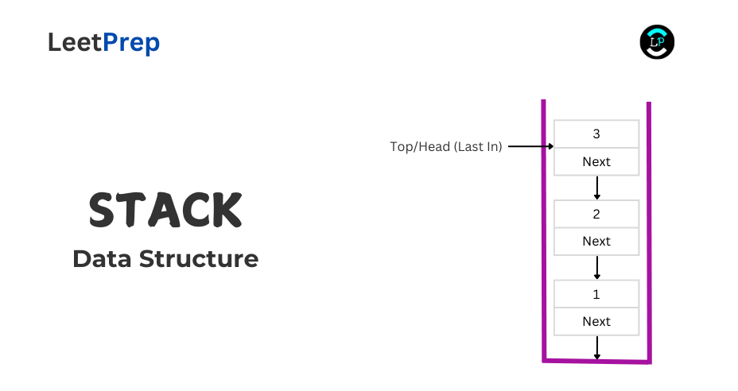
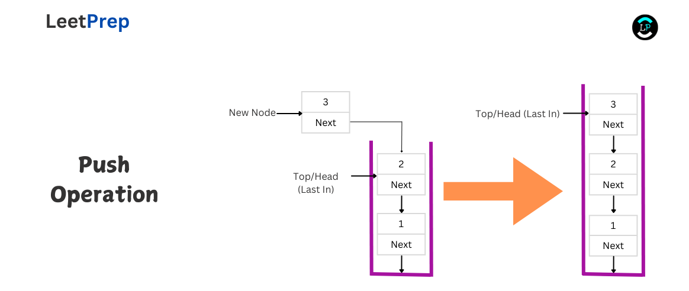
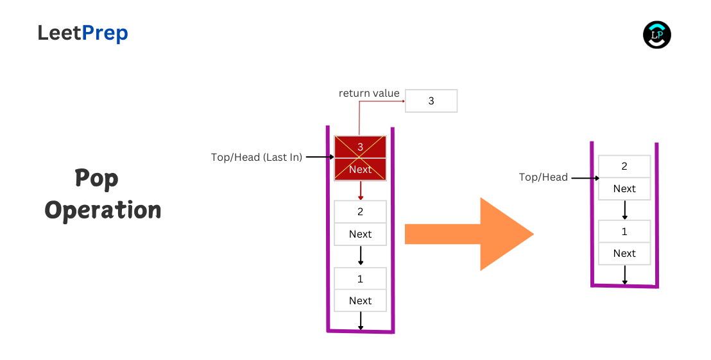

# **INTRODUCTION TO STACKS**

In this course, we will explore the queue data structures. This course is divided into the following sections:

1. **Definition of Stacks**
2. **Stack Operations**
3. **Advantages of Stacks**
4. **Disadvantages of Stacks**
5. **Applications of Stacks**
6. **Practice Problems on Stacks**
7. **Building a Stack**

## **Definition of Stacks**

A Stack is a linear data structure that operates on the principle of LIFO (Last In, First Out). This means that the last item added to the stack is the first to be removed.

Imagine a stack of books on a shelf. When you place a new book on top, it becomes the first one you pick up when you need a book.

A stack can be implemented using either an array or a linked list:

1. **Array Implementation**:
   - An array-based stack uses a fixed-size array to hold elements. Operations like `push` (adding an element) and `pop` (removing an element) are performed with direct index access, making them efficient.
   - However, arrays have a limitation: they are of fixed size, so if the stack grows beyond its allocated size, resizing or handling overflow becomes necessary.
2. **Linked List Implementation**:
   - A linked list-based stack is more flexible as it dynamically grows or shrinks based on the number of elements. Each node in the linked list contains data and a pointer to the next node.
   - Operations such as `push` and `pop` are efficient since adding or removing the top element only involves updating the head pointer.

For this course, we'll implement a stack using a singly linked list. This approach ensures dynamic memory allocation, allowing the stack to expand or contract without predefined size limitations. Ensure you've gone through our linked lists course before this.

## **Stack Operations**

There are several operations you can perform on stacks. Here are some of the basic ones:

1. Peek
2. Push
3. Pop

### **Peek** 

This operation involves retrieving the value of the top element (the head of the linked list) without removing it or  modifying any pointers.

The **Time Complexity** is O(1), because it directly accesses the head node, while the **Space Complexity** is also O(1), because no additional space is used beyond the current stack structure.

------

### **Push**

This operation involves adding a new element to the top of the stack (the head of the linked list). A new node is created, and its `next` pointer is set to point to the current head. Then, the new node is updated to become the new head of the linked list.

The **Time Complexity** is O(1), because inserting at the head of the linked list is a constant-time operation, while the **Space Complexity** is also O(1), because adding a single node doesn’t require additional space other than the new node itself.

------

### **Pop**

This operation involves removing and returning the the top element (the head of the linked list) from the stack. The `next` pointer of the current head node is set as the new head of the linked list, effectively detaching and removing the original head node.

The **Time Complexity** is O(1), because removing the head node and updating the pointer is done in constant time, while the **Space Complexity** is also O(1), because no additional space is used; the existing node is simply removed from the stack.

------

## **Advantages of Stacks**

1. Simple and efficient operations with constant-time.
2. Memory efficiency when implemented using linked lists, dynamically growing or shrinking as needed.
3. Manages function calls and recursion effectively via the call stack.
4. Ideal for backtracking algorithms, allowing easy tracking and reversal of states.

## **Disadvantages of Stacks**

1. Limited access, as only the top element is accessible at any time.
2. Risk of overflow in array-based stacks if the allocated size is exceeded.
3. Potential underutilization of space in array-based stacks when the element count decreases.
4. Inefficient for searching, requiring popping of elements to find a specific item.
5. Not suited for complex operations or multiple queries on data, limiting flexibility.

## **Application of Stacks**

1. Web browsers use stacks to manage the "back" and "forward" navigation history.
2. Text editors use stacks for implementing undo and redo operations.
3. Function calls and recursion in programming are managed using a call stack to track active functions.
4. Expression evaluation, such as in calculators or compilers, uses stacks to handle operations and operands in postfix or infix notation.
5. Stacks are used in depth-first search (DFS) algorithms for exploring graphs, keeping track of nodes to visit next.

## **Practical Problems on Stacks**

- [Valid Parentheses](https://leetprep.io/problems/20)
- [Removing Stars From a String](https://leetprep.io/problems/2390)
- [Car Fleet](https://leetprep.io/problems/853)
- [Remove K Digits](https://leetprep.io/problems/402)

Explore more from the recommendations of any of those problems on **LeetPrep**.
